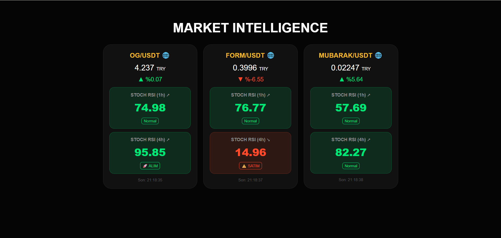

# 🚀 Crypto Market Intelligence (1H & 4H)

Bu uygulama, Binance üzerindeki kripto varlıkları hem **1 saatlik (1H)** hem de **4 saatlik (4H)** periyotlarda eş zamanlı olarak takip eden, teknik analiz (Stochastic RSI) tabanlı bir takip ve bildirim botudur.

This is a technical analysis and notification bot that simultaneously monitors crypto assets on Binance in both **1-hour (1H)** and **4-hour (4H)** timeframes using Stochastic RSI.

---

## 🇹🇷 Özellikler
* **Çift Zaman Dilimi:** Her sembol için 1H ve 4H Stoch RSI değerlerini aynı anda görüntüleme.
* **Gerçek Zamanlı Analiz:** Binance API üzerinden her 2 dakikada bir otomatik veri güncelleme.
* **Anlık Bildirimler:** Aşırı satım (Stoch K < 15) durumunda Web Push ve E-posta (Yandex/SMTP) bildirimleri.
* **Dinamik UI:** Trend yönüne göre (Yukarı/Aşağı) değişen renkli kart arayüzü ve Stoch RSI ivme takibi.
* **Mobil Uyumlu:** Node.js ve Express tabanlı, her cihazda çalışan şık web dashboard.

## 🇺🇸 Features
* **Dual Timeframes:** Display 1H and 4H Stoch RSI values simultaneously for each symbol.
* **Real-time Analysis:** Automatic data updates every 2 minutes via Binance API.
* **Instant Notifications:** Web Push and Email (Yandex/SMTP) alerts during oversold conditions (Stoch K < 15).
* **Dynamic UI:** Card-based interface with colors that change according to trend direction (Up/Down) and Stoch RSI momentum.
* **Mobile Friendly:** Node.js and Express-powered web dashboard accessible from any device.

---

## 🛠 Kurulum / Installation

1. **Repo'yu klonlayın / Clone the repo:**
   ```bash
   git clone [https://github.com/kullaniciadi/proje-adi.git](https://github.com/kullaniciadi/proje-adi.git)
   cd proje-adi


